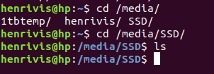

# Ubuntu/Windows

Just updated my Ubuntu 16.04 to 18.04 using a bootable pen drive w/ Ubuntu 18.04. It worked pretty well actually, i chose the option: "something else" and selected the partition Ubuntu 16.04 was installed and it end up keeping most of my files and configurations \(shortcuts, Desktop files, bashrc as well...\), but apps like Spotify, Skype and Teamviewer not. One thing to be noticed is that ROS Kinetic was installed and i didn't uninstall it, but i think the binaries from the 16.04 have been deleted so the linkings were removed automatically, what i mean by that is that if i try: `sudo apt-get purge ros-kinetic`

It won't work because the linkings are all gone, but ros is still on /opt/ros, meaning i deleted it manually.

The shared partitions with windows were crashed:

And the folder that was being mounted automatically in `/etc/fstab` isn't being mounted anymore \(makes sense, see output\), but what was most intriguing was that the shared folders, located on /media/ were deleted:

Actually, when going over to W10 i checked and the shared folders were there, intact, still on the `D:` drive, nothing changed, good! So i went back to Ubuntu and just mount it manually by doing:

`sudo mount /dev/sda3 /media/SSD/`

And now \(instantly\) the folders are now back as it was before! Neat!

I just have to update /etc/fstab with the automount option so it mounts every time PC initializes. To do that just append this snippet of code to the end of the fstab:

`UUID=B01097C010978C4A /media/SSD ntfs -3g auto,user,rw 0 0`

To retrieve the UUID from the disk, just `blkid` and check if the pointer matches your wished location, in my case my pointer was /dev/sda3, so just check which UUID matches to /dev/sda3.

